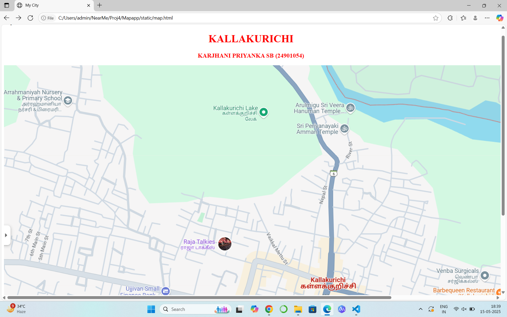
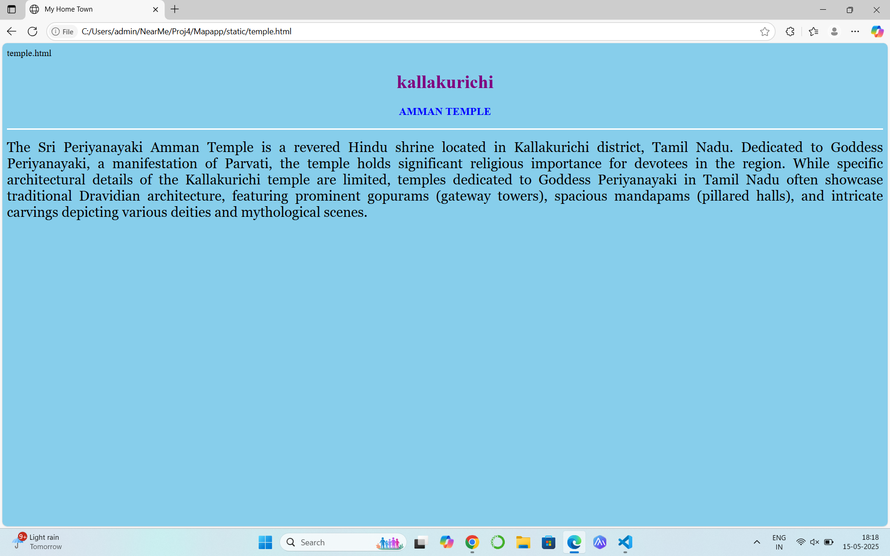
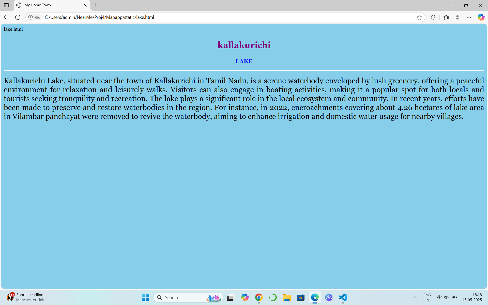
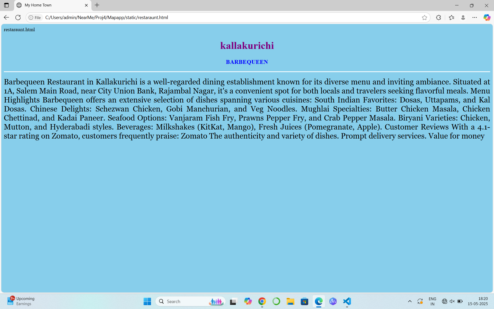
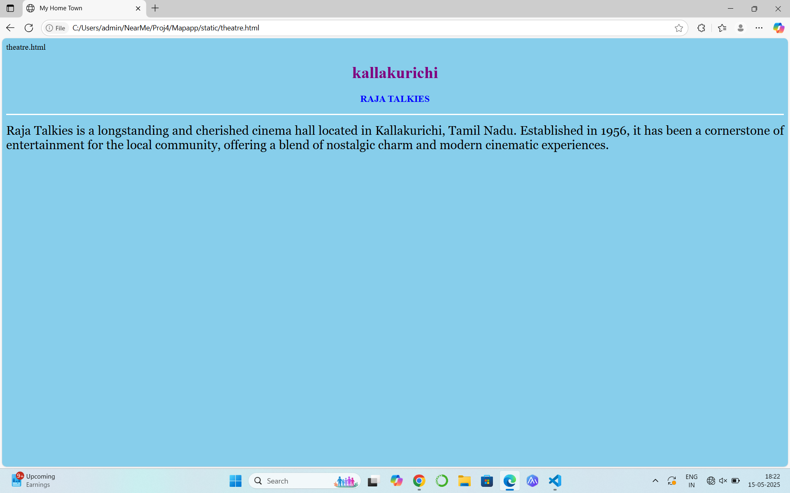
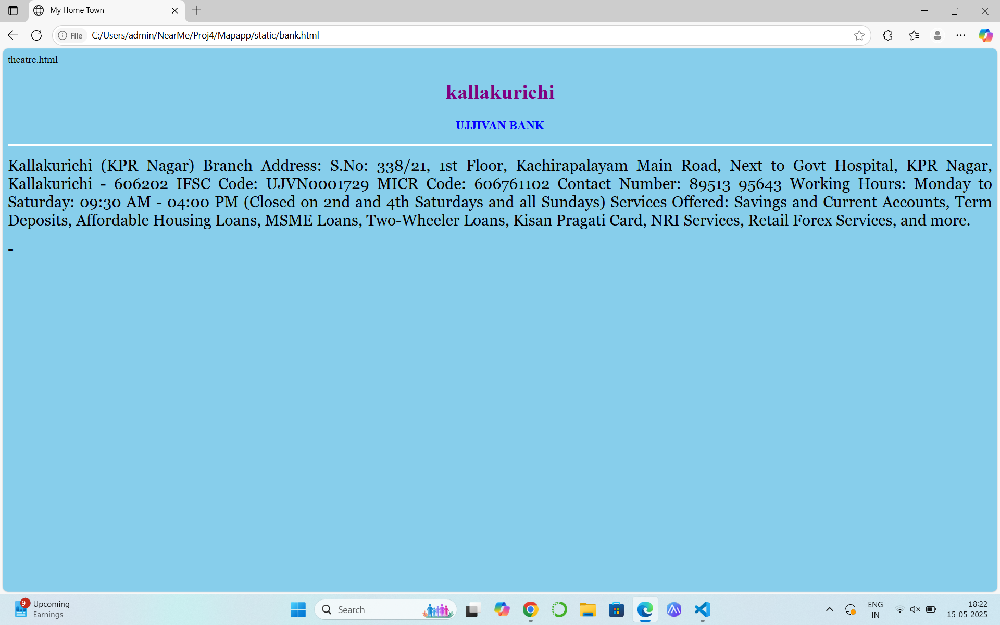

# Ex04 Places Around Me
## Date: 15/05/2025

## AIM
To develop a website to display details about the places around my house.

## DESIGN STEPS

### STEP 1
Create a Django admin interface.

### STEP 2
Download your city map from Google.

### STEP 3
Using ```<map>``` tag name the map.

### STEP 4
Create clickable regions in the image using ```<area>``` tag.

### STEP 5
Write HTML programs for all the regions identified.

### STEP 6
Execute the programs and publish them.

## CODE:
```
map.html
<!DOCTYPE html>
<html lang="en">
<head>
    <meta charset="UTF-8">
    <meta name="viewport" content="width=device-width, initial-scale=1.0">
    <title>My City</title>
</head>
<body>
 <center>
    <h1 style="color:red">KALLAKURICHI</h1>
    <h3 style="color:red">KARJHANI PRIYANKA SB (24901054)</h3>
 </center>   


<map name="image-map">
    <area target="" alt="ujjivan bank" title="ujjivan bank" href="bank.html" coords="119,210,130" shape="circle">
    <area target="" alt="raja talkies" title="raja talkies" href="theatre.html" coords="1106,480,110" shape="circle">
    <area target="" alt="barbequeen" title="barbequeen" href="restaraunt.html" coords="907,147,103" shape="circle">
    <area target="" alt="kallakurichi lake" title="kallakurichi lake" href="lake.html" coords="353,568,108" shape="circle">
    <area target="" alt="amman temple" title="amman temple" href="temple.html" coords="323,195,65" shape="circle">
</map>
</center>
</body>
</html>
```
```
temple.html
<html>
<head>
<title>My Home Town</title>
</head>
<body bgcolor="skyblue">
<h1 align="center">
<font color="purple"><b>kallakurichi</b></font>
</h1>
<h3 align="center">
<font color="blue"><b>AMMAN TEMPLE</b></font>
</h3>
<hr size="3" color="white">
<p align="justify">
<font face="Georgia" size="5">
    The Sri Periyanayaki Amman Temple is a revered Hindu shrine located in Kallakurichi district, Tamil Nadu.
    Dedicated to Goddess Periyanayaki, a manifestation of Parvati, the temple holds significant religious importance for devotees in the region.
    While specific architectural details of the Kallakurichi temple are limited, temples dedicated to Goddess Periyanayaki in Tamil Nadu often showcase traditional Dravidian architecture, 
    featuring prominent gopurams (gateway towers), spacious mandapams (pillared halls), and intricate carvings depicting various deities and mythological scenes.

</p>
</body>
</html>
```

```
lake.html
<html>
<head>
<title>My Home Town</title>
</head>
<body bgcolor="skyblue">
<h1 align="center">
<font color="purple"><b>kallakurichi</b></font>
</h1>
<h3 align="center">
<font color="blue"><b>LAKE</b></font>
</h3>
<hr size="3" color="white">
<p align="justify">
<font face="Georgia" size="5">
    Kallakurichi Lake, situated near the town of Kallakurichi in Tamil Nadu, is a serene waterbody enveloped by lush greenery,
    offering a peaceful environment for relaxation and leisurely walks.
    Visitors can also engage in boating activities, making it a popular spot for both locals and tourists seeking tranquility and recreation. 
    The lake plays a significant role in the local ecosystem and community. 
    In recent years, efforts have been made to preserve and restore waterbodies in the region. 
    For instance, in 2022, encroachments covering about 4.26 hectares of lake area in Vilambar panchayat were removed to revive the waterbody, 
    aiming to enhance irrigation and domestic water usage for nearby villages.
 
</p>
</body>
</html>
```

```
restaraunt.html
<html>
<head>
<title>My Home Town</title>
</head>
<body bgcolor="skyblue">
<h1 align="center">
<font color="purple"><b>kallakurichi</b></font>
</h1>
<h3 align="center">
<font color="blue"><b>BARBEQUEEN</b></font>
</h3>
<hr size="3" color="white">
<p align="justify">
<font face="Georgia" size="5">
    Barbequeen Restaurant in Kallakurichi is a well-regarded dining establishment known for its diverse menu and inviting ambiance. 
    Situated at 1A, Salem Main Road, near City Union Bank, Rajambal Nagar, it's a convenient spot for both locals and travelers seeking flavorful meals.
    Menu Highlights
 Barbequeen offers an extensive selection of dishes spanning various cuisines:
South Indian Favorites: Dosas, Uttapams, and Kal Dosas.
Chinese Delights: Schezwan Chicken, Gobi Manchurian, and Veg Noodles.
Mughlai Specialties: Butter Chicken Masala, Chicken Chettinad, and Kadai Paneer.
Seafood Options: Vanjaram Fish Fry, Prawns Pepper Fry, and Crab Pepper Masala.
Biryani Varieties: Chicken, Mutton, and Hyderabadi styles.
Beverages: Milkshakes (KitKat, Mango), Fresh Juices (Pomegranate, Apple).
Customer Reviews
With a 4.1-star rating on Zomato, customers frequently praise:
Zomato
The authenticity and variety of dishes.
Prompt delivery services.
Value for money

</p>
</body>
</html>
```

```
theatre.html
<html>
<head>
<title>My Home Town</title>
</head>
<body bgcolor="skyblue">
<h1 align="center">
<font color="purple"><b>kallakurichi</b></font>
</h1>
<h3 align="center">
<font color="blue"><b>RAJA TALKIES</b></font>
</h3>
<hr size="3" color="white">
<p align="justify">
<font face="Georgia" size="5">
    Raja Talkies is a longstanding and cherished cinema hall located in Kallakurichi, Tamil Nadu. 
    Established in 1956, it has been a cornerstone of entertainment for the local community, 
    offering a blend of nostalgic charm and modern cinematic experiences.

</p>
</body>
</html>
```

```
bank.html
<html>
<head>
<title>My Home Town</title>
</head>
<body bgcolor="skyblue">
<h1 align="center">
<font color="purple"><b>kallakurichi</b></font>
</h1>
<h3 align="center">
<font color="blue"><b>UJJIVAN BANK</b></font>
</h3>
<hr size="3" color="white">
<p align="justify">
<font face="Georgia" size="5">
    Kallakurichi (KPR Nagar) Branch
Address: S.No: 338/21, 1st Floor, Kachirapalayam Main Road, Next to Govt Hospital, KPR Nagar, Kallakurichi - 606202
IFSC Code: UJVN0001729
MICR Code: 606761102
Contact Number: 89513 95643
Working Hours: Monday to Saturday: 09:30 AM - 04:00 PM (Closed on 2nd and 4th Saturdays and all Sundays)
Services Offered: Savings and Current Accounts, Term Deposits, Affordable Housing Loans, MSME Loans, Two-Wheeler Loans, Kisan Pragati Card, NRI Services, Retail Forex Services, and more. 

</p>
</body>
</html>
```


## OUTPUT











# RESULT
The program for implementing image maps using HTML is executed successfully.
